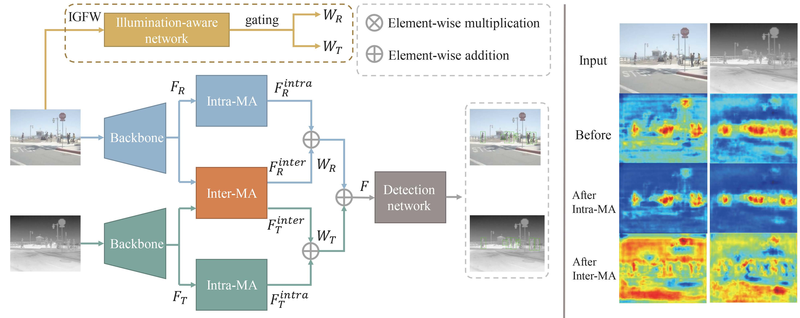

# Triple-I Net (TINet)
Official code for "Illumination-guided RGBT Object Detection with Inter- and Intra-modality Fusion"



## Installation
Please refer to <https://github.com/open-mmlab/mmdetection/tree/2.x>

## Results
Below is the ablation study for our TINet on FLIR-aligned (the training and testing splits follow the official splits). 
Note that in our paper the results are given by a different train/test data distribution. 
If you intend to include our results, please make sure that the data distribution is aligned.

|     IGFW    |     Inter-MA    |     Intra-MA    |     AP50     |     mAP      |
|-------------|-----------------|-----------------|--------------|--------------|
|             |                 |                 |     75.19    |     35.88    |
|     √       |                 |                 |     74.94    |     36.41    |
|             |     √           |                 |     75.00    |     36.21    |
|             |                 |     √           |     74.96    |     36.07    |
|     √       |     √           |                 |     75.27    |     36.70    |
|     √       |                 |     √           |     75.42    |     36.61    |
|             |     √           |     √           |     75.32    |     36.06    |
|     √       |     √           |     √           |     76.07    |     36.54    |

## Dataset
For KAIST dataset we use the sanitized annotation provided by Li et al in *Illumination-aware faster RCNN for robust multispectral pedestrian detection*. We upload it to our [google drive](https://drive.google.com/file/d/1De0_xBM74CdsZW8a7eUVrF4RUtl1Oxx6/view?usp=drive_link) since the original link is invalid. Cleaned JSON-format annotations are at our [google drive](https://drive.google.com/drive/folders/1BZbJ_gkQ2b-ARFCWvkT64XtJBIwP7a6f?usp=sharing).  The FLIR-align dataset can be downloaded at (http://shorturl.at/ahAY4), which is provided by Zhang et al in *Multispectral Fusion for Object Detection with Cyclic Fuse-and-Refine Blocks*. The coco-json format annotation file is at our [google drive](https://drive.google.com/drive/folders/1aNzKmeS9PeaOAoX6D6Ro2cKPzLaAMt7q?usp=drive_link).

### DayNight Labels
We insert the DayNight labels into the filename of every visible image in the training set. "1" stands for daytime images and "3" stands for nighttime images. During image loading, we read the filename and extract the label. Below is the script that we rename the FLIR-aligned training set. Note that it runs on a Windows system.
```
def ill_rename():
    img_files = glob.glob('F:\\data\\FLIR\\FLIR_aligned\\format\\train\\visible\\*.jpeg')
    xml_files = glob.glob('F:\\data\\FLIR\\FLIR_aligned\\format\\train\\annotation\\*.xml')
    day_ids = list(range(0, 70)) + list(range(84, 2245)) + list(range(2367, 3476)) + list(range(3583, 3675)) + \
              list(range(4085, 4129))
    night_ids = list(range(70, 84)) + list(range(2245, 2367)) + list(range(3476, 3583)) + list(range(3675, 4085))

    for day_id in day_ids:
        img_file = img_files[day_id]
        xml_file = xml_files[day_id]
        filename = os.path.split(xml_file)[-1]
        new_filename = filename[:4]+'0'+filename[4:]
        fname = os.path.splitext(filename)[0]
        os.rename(img_file, os.path.join('train', 'visible', new_filename.replace('.xml', '.jpeg')))
        os.rename(os.path.join('train', 'thermal', filename.replace('.xml', '.jpeg')),
                  os.path.join('train', 'thermal', new_filename.replace('.xml', '.jpeg')))
        xml = os.path.join('train', 'annotation', fname+'.xml')
        tree = ET.parse(xml)
        root = tree.getroot()
        filename = root[3]
        filename.text = new_filename.replace('.xml', '.jpeg')
        tree.write(xml)
        os.rename(xml, os.path.join('train', 'annotation', new_filename))

    for night_id in night_ids:
        img_file = img_files[night_id]
        xml_file = xml_files[night_id]
        filename = os.path.split(xml_file)[-1]
        new_filename = filename[:4]+'3'+filename[4:]
        fname = os.path.splitext(filename)[0]
        os.rename(img_file, os.path.join('train', 'visible', new_filename.replace('.xml', '.jpeg')))
        os.rename(os.path.join('train', 'thermal', filename.replace('.xml', '.jpeg')),
                  os.path.join('train', 'thermal', new_filename.replace('.xml', '.jpeg')))
        xml = os.path.join('train', 'annotation', fname+'.xml')
        tree = ET.parse(xml)
        root = tree.getroot()
        filename = root[3]
        filename.text = new_filename.replace('.xml', '.jpeg')
        tree.write(xml)
        os.rename(xml, os.path.join('train', 'annotation', new_filename))
```

## Citation
````
@ARTICLE{tinet,
  author={Zhang, Yan and Yu, Huai and He, Yujie and Wang, Xinya and Yang, Wen},
  journal={IEEE Transactions on Instrumentation and Measurement}, 
  title={Illumination-Guided RGBT Object Detection With Inter- and Intra-Modality Fusion}, 
  year={2023},
  volume={72},
  number={},
  pages={1-13},
  doi={10.1109/TIM.2023.3251414}}
````
